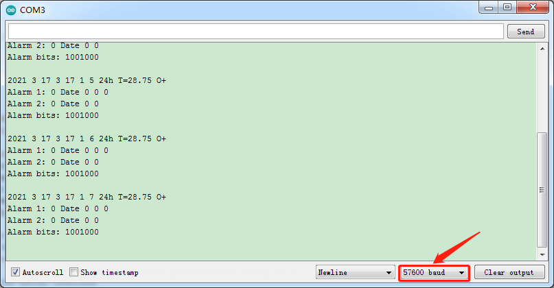

# Arduino


## 1. Arduino简介  

Arduino是一种开源电子原型平台，设计目的是为开发者、教育工作者和爱好者提供一个易于使用的环境，以创建互动电子项目。自2005年推出以来，Arduino因其简洁的编程接口和易于连接的硬件而受到广泛欢迎。Arduino硬件包括多种开发板，如Arduino UNO、MEGA等，用户可以通过Arduino IDE编写和上传代码，利用C/C++语言直接控制各类传感器和执行器。Arduino广泛应用于机器人、智能家居、自动化控制、艺术创作等各个领域，适合各个层次的学习者。  

## 2. 连接图  

  

## 3. 测试代码  

```cpp  
#include <DS3231.h>  
#include <Wire.h>  

DS3231 clock;  

bool century = false;  
bool h12Flag;  
bool pmFlag;  
byte alarmDay, alarmHour, alarmMinute, alarmSecond, alarmBits;  
bool alarmDy, alarmH12Flag, alarmPmFlag;  

void setup() {  
    // Start the I2C interface  
    Wire.begin();  
    // Start the serial interface  
    Serial.begin(57600);  
}  

void loop() {  
    // send what's going on to the serial monitor.  
    // Start with the year  
    Serial.print("2");  
    if (century) {  
        Serial.print("1");  
    } else {  
        Serial.print("0");  
    }  
    Serial.print(clock.getYear(), DEC);  
    Serial.print(' ');  

    // then the month  
    Serial.print(clock.getMonth(century), DEC);  
    Serial.print(" ");  

    // then the date  
    Serial.print(clock.getDate(), DEC);  
    Serial.print(" ");  

    // and the day of the week  
    Serial.print(clock.getDoW(), DEC);  
    Serial.print(" ");  

    // Finally the hour, minute, and second  
    Serial.print(clock.getHour(h12Flag, pmFlag), DEC);  
    Serial.print(" ");  
    Serial.print(clock.getMinute(), DEC);  
    Serial.print(" ");  
    Serial.print(clock.getSecond(), DEC);  

    // Add AM/PM indicator  
    if (h12Flag) {  
        if (pmFlag) {  
            Serial.print(" PM ");  
        } else {  
            Serial.print(" AM ");  
        }  
    } else {  
        Serial.print(" 24h ");  
    }  

    // Display the temperature  
    Serial.print("T=");  
    Serial.print(clock.getTemperature(), 2);  

    // Tell whether the time is (likely to be) valid  
    if (clock.oscillatorCheck()) {  
        Serial.print(" O+");  
    } else {  
        Serial.print(" O-");  
    }  

    // Indicate whether an alarm went off  
    if (clock.checkIfAlarm(1)) {  
        Serial.print(" A1!");  
    }  

    if (clock.checkIfAlarm(2)) {  
        Serial.print(" A2!");  
    }  

    // New line on display  
    Serial.println();  

    // Display Alarm 1 information  
    Serial.print("Alarm 1: ");  
    clock.getA1Time(alarmDay, alarmHour, alarmMinute, alarmSecond, alarmBits, alarmDy, alarmH12Flag, alarmPmFlag);  
    Serial.print(alarmDay, DEC);  
    if (alarmDy) {  
        Serial.print(" DoW");  
    } else {  
        Serial.print(" Date");  
    }  
    Serial.print(' ');  
    Serial.print(alarmHour, DEC);  
    Serial.print(' ');  
    Serial.print(alarmMinute, DEC);  
    Serial.print(' ');  
    Serial.print(alarmSecond, DEC);  
    Serial.print(' ');  

    if (alarmH12Flag) {  
        if (alarmPmFlag) {  
            Serial.print("pm ");  
        } else {  
            Serial.print("am ");  
        }  
    }  

    if (clock.checkAlarmEnabled(1)) {  
        Serial.print("enabled");  
    }  
    Serial.println();  

    // Display Alarm 2 information  
    Serial.print("Alarm 2: ");  
    clock.getA2Time(alarmDay, alarmHour, alarmMinute, alarmBits, alarmDy, alarmH12Flag, alarmPmFlag);  
    Serial.print(alarmDay, DEC);  
    if (alarmDy) {  
        Serial.print(" DoW");  
    } else {  
        Serial.print(" Date");  
    }  
    Serial.print(" ");  
    Serial.print(alarmHour, DEC);  
    Serial.print(" ");  
    Serial.print(alarmMinute, DEC);  
    Serial.print(" ");  
    
    if (alarmH12Flag) {  
        if (alarmPmFlag) {  
            Serial.print("pm");  
        } else {  
            Serial.print("am");  
        }  
    }  

    if (clock.checkAlarmEnabled(2)) {  
        Serial.print("enabled");  
    }  

    // display alarm bits  
    Serial.println();  
    Serial.print("Alarm bits: ");  
    Serial.println(alarmBits, BIN);  
    Serial.println();  

    delay(1000);  
}  
```  

## 4. 代码说明  

在使用本代码之前，请确保您已加载DS3231库。上传代码后，打开串口监视器并设置波特率为57600，您将看到DS3231检测到的日期、时间、温度、闹钟等相关信息。这段代码使用DS3231RTC模块，与Arduino进行I2C通信来获取当前的系统时间和温度。  

## 5. 测试结果  

上传代码完成后，通过串口监视器观察到的输出应包括当前的年、月、日、星期、小时、分钟、秒钟以及温度信息，如下图所示：  




