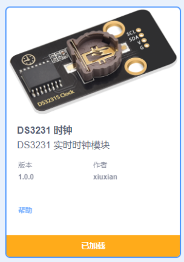
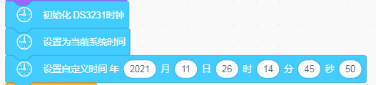
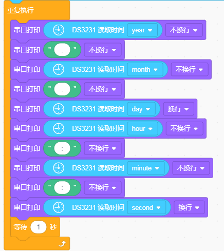
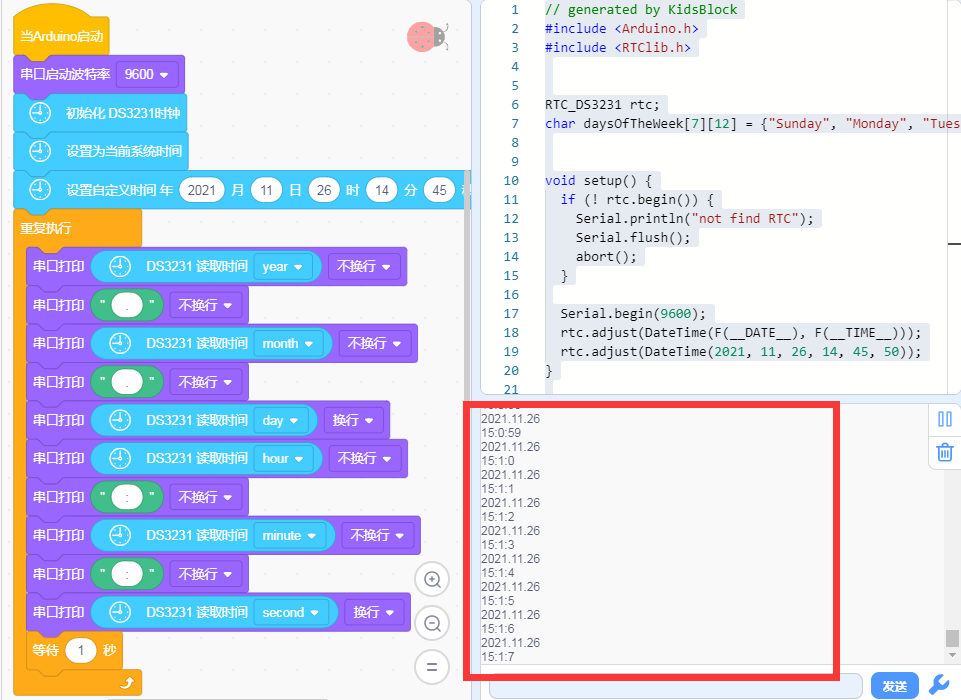

# KidsBlock

## 1. KidsBlock简介  

KidsBlock是一款基于图形化编程的教育平台，旨在帮助儿童和初学者通过直观的可视化界面学习编程和电子学的基本概念。该平台支持多种编程语言，包括Arduino C语言、Scratch和Mixly，借助简单的拖放操作，用户可以轻松创建互动项目。KidsBlock鼓励创造性思维并培养解决问题的能力，适合各个年龄段的学习者，并在编码和电子学的学习中给予丰富的实践体验。  

## 2. 连接图  

  

## 3. 测试代码步骤  

1. 在事件栏拖出Arduino启动模块  

     

2. 在串口栏拖出设置串口波特率模块  

     

3. 添加DS3231时钟的代码块，首先在编译串口的左下角点击“添加扩展”  

     

   然后在传感器下面找到DS3231模块。  

     

4. 在时钟模块拖出初始化、设置系统时间、设置自定义时间这三个模块，并在“设置自定义时间”模块上设置所需的时间。  

     

5. 在控制栏拖出循环执行模块。  

     

6. 在串口栏拖出串口打印模块，并在DS3231栏下拖出读取时间模块，然后选择需要读取的时间单位。  

     

## 4. 测试结果  

首先加载DS3231库，加载完成后上传代码。上传代码后，打开串口监视器并设置波特率为57600，我们将看到DS3231检测到的日期、时间、温度、闹钟等相关信息。  

