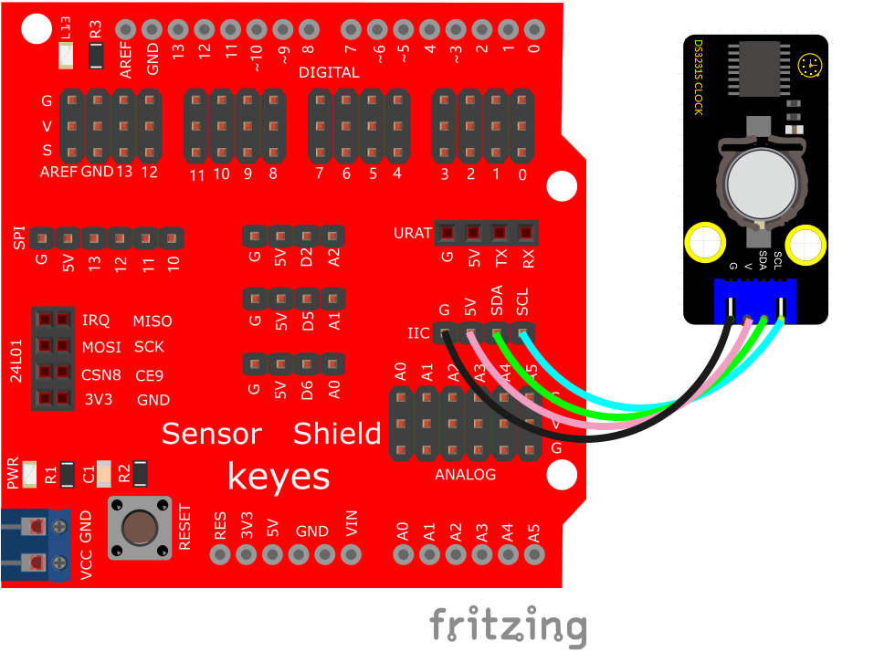
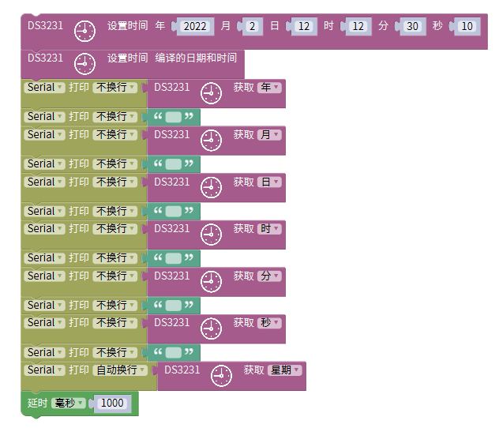
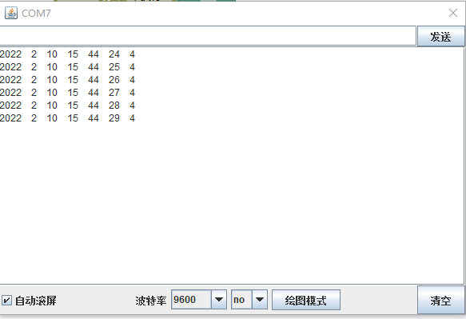

# Mixly

## 1. Mixly简介  

Mixly是一款基于图形化编程的教育平台，旨在帮助儿童和初学者通过简单、直观的界面学习编程和电子学的基本概念。该平台支持Arduino C语言和Scratch编程，通过将编程模块拖放到工作区，用户可以轻松创建互动项目。Mixly为用户提供丰富的模块和示例，致力于提升用户的创造力和实践能力，适合各个年龄段的学习者。  

## 2. 接线图  

  

## 3. 测试代码  

1. 需要先在Mixly软件中加载DS3231的库，确保可以使用该模块。  

  

2. 上传代码后，打开串口监视器，设置波特率为9600。  

3. 我们将看到DS3231模块检测到的日期、时间等相关信息。  

