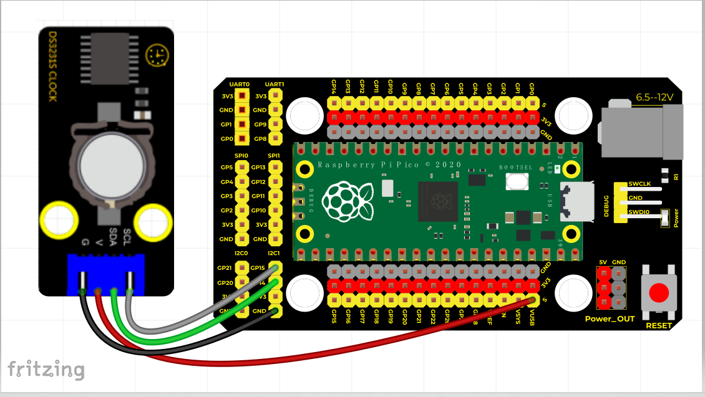
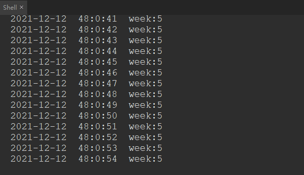

# Python


## 1. Python简介  

Python是一种广泛使用的高级编程语言，以其清晰的语法和强大的功能而著称。它由Guido van Rossum于1991年首次发布，旨在强调代码的可读性和简洁性。Python支持多种编程范式，包括面向对象、过程化和函数式编程，使得它适用于多种类型的开发项目。Python有丰富的标准库和第三方库，涵盖数据分析、人工智能、Web开发、自动化脚本等多个领域。Python的软件生态迅速发展，并采用严格的开源政策，受到广泛社区的支持。  

## 2. 连接图  

| 树莓派PICO  | DS3231时钟模块 |  
| ----------- | --------------- |  
| VUSB        | V               |  
| GNG         | G               |  
| GPIO14      | SDA             |  
| GPIO15      | SCL             |  

  

## 3. 测试代码  

```python  
from machine import I2C, Pin  
from urtc import DS3231  
import utime  

i2c = I2C(1, scl=Pin(15), sda=Pin(14), freq=400000)  
rtc = DS3231(i2c)  

year = int(input("Year : "))  
month = int(input("month (Jan --> 1 , Dec --> 12): "))  
date = int(input("date : "))  
day = int(input("day (1 --> Monday , 2 --> Tuesday ... 0 --> Sunday): "))  
hour = int(input("hour (24 Hour format): "))  
minute = int(input("minute : "))  
second = int(input("second : "))  

now = (year, month, date, day, hour, minute, second, 0)  
rtc.datetime(now)  

while True:  
    DateTimeTuple = rtc.datetime()  
    print(DateTimeTuple[0], end='-')  
    print(DateTimeTuple[1], end='-')  
    print(DateTimeTuple[2], end=' ')  
    print(DateTimeTuple[4], end=':')  
    print(DateTimeTuple[5], end=':')  
    print(DateTimeTuple[6], end=' week:')  
    print(DateTimeTuple[3])  
    utime.sleep(1)  
```  

## 4. 代码说明  

在实验中，需要导入`urtc`模块，以便使用DS3231实时时钟的功能。代码首先要求输入年份、月份、日期、星期、小时、分钟和秒数。之后，通过`rtc.datetime(now)`设置当前日期和时间。使用循环，程序每秒打印当前的日期和时间。返回的时间日期元组包括年、月、日、星期、时、分、秒。  

## 5. 测试结果  

烧录好测试代码，按照接线图连接好线；利用USB接口上电后，进入串口监视器，设置波特率为9600。可在软件串口监视器中看到输入的时间日期（年、月、日、时、分、秒、星期），如下图所示。  




